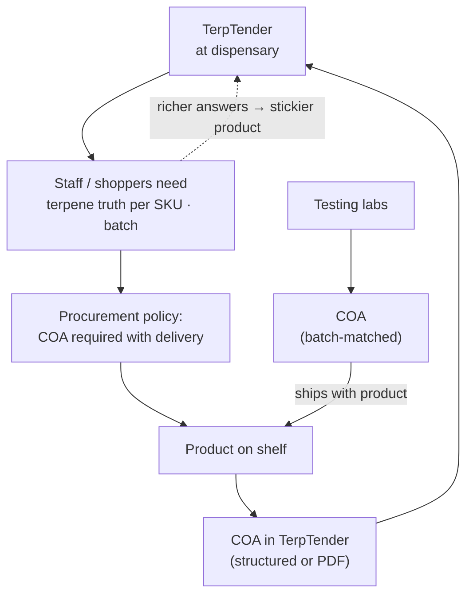
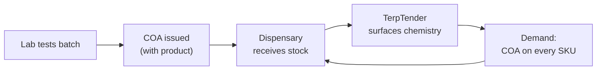

# TerpTender API

Cloud Run service for **dispensaries**, **products**, **testing labs**, and **terpene COAs**, backed by **Firestore**, plus **Vertex Gemini** for inventory- and lab-aware chat. Same GCP project and service-account style as **gemini-proxy** (Tersona).

**Front page:** open the service root URL (`/`) for the TerpTender story, flywheel diagram, and links to **`/docs`** and **`/health`**.

**Positioning:** sit **above compliance minimums** (e.g. Metrc) and **beside labs** as a structured data partner: ingest full LIMS-style analyte rows (value, units, LOQ/LOD, method), normalize terpene naming across vendors, and keep raw payloads for audit / PDF backfill.

## Go-to-market angle (dispensary → COA → labs)

**Wedge:** get **TerpTender** adopted inside **dispensaries** (POS-adjacent workflow, budtender tools, or white-label chat). Once staff and shoppers expect **accurate, batch-level terpene answers**, the dispensary **must** attach real **COAs** to SKUs. Those COAs **already travel with the product** from **labs** that tested the batch—TerpTender is the reason the data gets **captured and used**, not left in a PDF drawer.

That creates aligned incentives: dispensaries want coverage, brands want shelf clarity, labs want their full panels to matter beyond the compliance minimum. Structured **`/imports/lab-results`** closes the loop; PDF storage still works for backfill.

### Flywheel (diagram)



### Linear value chain (same story, left → right)



## Data model (Firestore)

Collections (prefix configurable via `TERPTENDER_FIRESTORE_PREFIX`, default `terptender`):

| Collection | Document fields (high level) |
|------------|------------------------------|
| `{prefix}_dispensaries` | `name`, `license_number`, `address`, `phone`, `email`, `website`, `notes`, `tags`, timestamps |
| `{prefix}_labs` | `name`, `license_number`, `lims_vendor`, `contact_email`, `website`, `notes`, timestamps |
| `{prefix}_products` | `dispensary_id`, `name`, `category`, `sku`, `strain_name`, `batch_id`, `brand`, `unit`, `notes`, `metadata`, timestamps |
| `{prefix}_coas` | `dispensary_id`, `product_id`, `lab_id`, `lab_name`, `lims_system`, `instrument_method`, `sample_id`, `tested_at`, `terpenes[]`, `cannabinoids[]`, `notes`, `document_url`, `raw_lims`, `metadata`, timestamps |

Terpene line (retail-simple or LIMS-rich):

```json
{ "name": "limonene", "percent_wt": 0.42, "mg_g": 4.2 }
```

```json
{
  "name": "β-Myrcene",
  "value": 0.82,
  "unit": "%",
  "loq": 0.01,
  "lod": 0.005,
  "method": "GC-MS",
  "below_loq": false
}
```

### Structured lab ingest (preferred over PDF-only)

`POST /imports/lab-results` accepts a LIMS-style payload (see `models.LabResultImport`): `sample_id`, `batch_id`, `product_type`, `terpenes[]`, `cannabinoids[]`, optional `raw_payload` for the full export, `lims_system`, `instrument_method`. With `normalize: true`, terpene names are mapped toward canonical slugs (`normalization.py`) and `%` / `mg/g` values populate `percent_wt` / `mg_per_g` where possible.

## API (REST)

- `GET /health`
- `POST|GET|PATCH|DELETE /dispensaries` (+ `GET /dispensaries/{id}`)
- `POST|GET|PATCH|DELETE /labs` (+ `GET /labs/{id}`) — testing / LIMS partner orgs
- `POST|GET|PATCH|DELETE /products` (+ `GET /products/{id}`), query `?dispensary_id=`
- `POST|GET|PATCH|DELETE /coas` (+ `GET /coas/{id}`), query `?dispensary_id=`, `?product_id=`, or `?lab_id=`
- `POST /imports/lab-results` — structured LIMS ingest → COA + `normalization_log`
- `POST /chat` — body may include `dispensary_id` and/or `lab_id` with `include_inventory_context` for Vertex grounding

## GCP setup

1. **Firestore** — In the same project, create a Firestore database (Native mode). Enable the **Firestore API**.
2. **Vertex AI** — Enable **Vertex AI API** (same as Tersona).
3. **IAM** — Grant the Cloud Run runtime service account (e.g. `terpenequeen-api@PROJECT.iam.gserviceaccount.com`):
   - `roles/datastore.user` (Firestore)
   - Existing Vertex / Gemini roles you already use for gemini-proxy (e.g. `roles/aiplatform.user`).

```bash
SA="terpenequeen-api@${GOOGLE_CLOUD_PROJECT}.iam.gserviceaccount.com"
gcloud projects add-iam-policy-binding "${GOOGLE_CLOUD_PROJECT}" \
  --member="serviceAccount:${SA}" --role="roles/datastore.user"
```

## Deploy

```bash
cd api/terptender
bash deploy-cloudrun-cloudbuild.sh
```

Optional env vars on Cloud Run:

| Variable | Purpose |
|----------|---------|
| `TERPTENDER_FIRESTORE_PREFIX` | Collection name prefix (default `terptender`) |
| `TERPTENDER_MODEL` | Vertex model id (default `gemini-2.0-flash-001`) |

## Local run

```bash
cd api/terptender
python3 -m venv .venv && .venv/bin/pip install -r requirements.txt
export GOOGLE_CLOUD_PROJECT=your-project
export GOOGLE_APPLICATION_CREDENTIALS=/path/to/sa.json   # or use gcloud auth application-default login
.venv/bin/uvicorn main:app --reload --port 8090
```

## Security note

`/chat` and CRUD endpoints are **unauthenticated** in the deploy script (same as gemini-proxy). Lock down with **IAM** (authenticated invokers), **API keys**, or a fronting gateway before storing real COA data.
